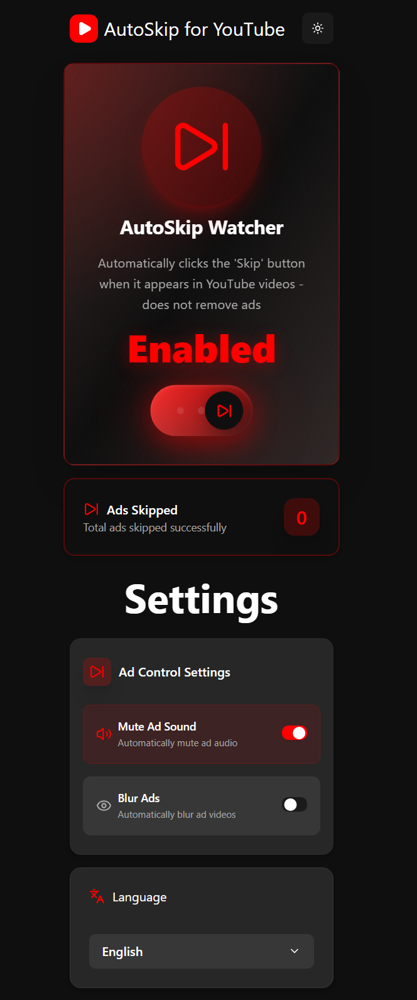
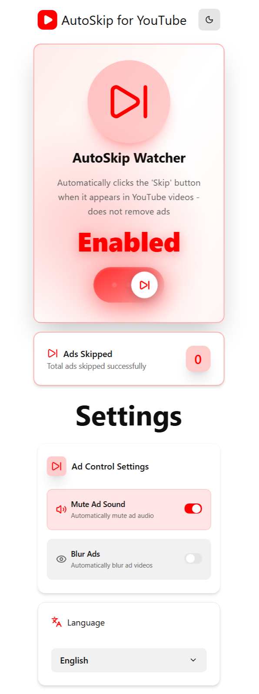
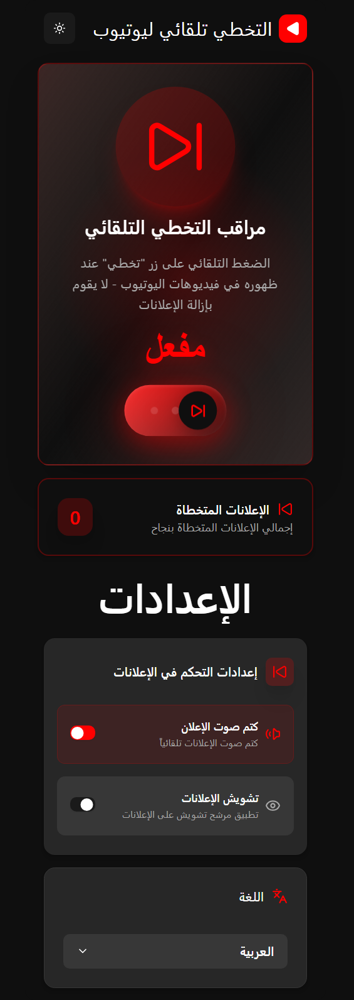
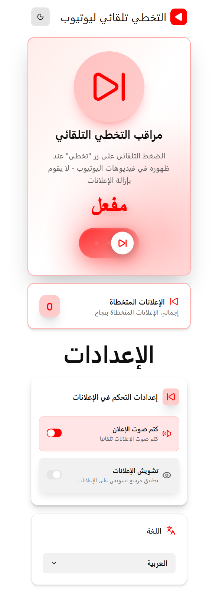

<h1 align="center">
  
  AutoSkip for YouTube
</h1>
<p align="center">
  <em>
    A smart and lightweight Chrome extension that automatically skips YouTube ads, mutes ads when needed, 
    and slightly reduces ad visibility using blur. 
    It never deletes ads and only interacts with the official “Skip Ads” button.
  </em>
</p>


<p align="center">
  
  
  
  
</p>

---

## ✨ Overview

**AutoSkip for YouTube** is a modern **Chrome Extension** built with **React** and **TypeScript**  
that enhances your YouTube watching experience by providing full control over ads while keeping content intact.  

It **automatically clicks the "Skip" button** as soon as it appears in YouTube videos — it **does not remove ads**  
and **fully complies with YouTube's policies**.

---

## 🎯 Core Features

| Feature | Description |
|------|------------|
| ⏭ **Auto Skip Ads** | Automatically clicks the *Skip Ad* button as soon as it appears |
| 🔇 **Mute Ads** | Option to mute ads when skipping is not available |
| 🌫 **Blur Ads** | Option to blur ads instead of removing them, reducing distraction while preserving content |
| 🧮 **Ads Skipped Counter** | Keeps track of the total number of ads successfully skipped |
| 🎛 **Enable / Disable Toggle** | Simple switch to turn the extension on or off |
| 🌍 **Multi-language Support** | Built-in internationalization using **i18next** |
| 🎨 **Modern UI** | Clean UI built with Tailwind CSS and Radix UI |
| ⚡ **High Performance** | Lightweight logic with minimal impact on browser performance |

---

## 🛠️ Tech Stack

| Category | Tools & Libraries |
|-------|------------------|
| **Core** | React 19.2.0, TypeScript 5.9.3, Vite 7.2.2 |
| **Extension APIs** | Chrome Extensions API |
| **UI** | Tailwind CSS, Shadcn / UI, Lucide Icons |
| **State & Logic** | Custom logic + Chrome storage |
| **Animations** | Motion |
| **Internationalization** | i18next, react-i18next |

---

## 📁 Folder Structure

```md

AutoSkip-for-YouTube/
├── src/
│   ├── components/          # Reusable UI components
│   │   ├── shared/          # Shared / common components
│   │   └── ui/              # Design system & primitive UI components
│   ├── constants/           # App-wide constants & enums
│   ├── contexts/            # React contexts (theme, settings, language)
│   ├── extension/           # Chrome extension logic
│   │   ├── background.ts    # Background service worker
│   │   └── content.ts       # Content script (YouTube DOM interaction)
│   ├── hooks/               # Custom React hooks
│   ├── i18n/                # i18next configuration & initialization
│   ├── lib/                 # Shared libraries & helpers
│   ├── types/               # Global TypeScript types
│   ├── utils/               # Utility functions
│   ├── App.tsx              # Popup root component
│   └── main.tsx             # React entry point
│
├── public/
│   ├── _locales/            # Chrome extension metadata translations
│   ├── assets/
│   │   ├── icons/           # Extension icons
│   │   └── screenshots/     # README screenshots
│   ├── locales/             # UI translations (design text & labels)
│   └── manifest.json        # Chrome extension manifest
│
├── vite.config.ts           # Vite base config (popup UI)
├── vite.content.config.ts   # Vite config for content script
├── vite.background.config.ts# Vite config for background worker
└── package.json

```

---

## 🎨 UI & UX

| Feature                      | Description                          |
| ---------------------------- | ------------------------------------ |
| 🌗 **Dark / Light Mode**     | Theme-friendly UI                    |
| 🧩 **Accessible Components** | Powered by Radix UI                  |
| 📱 **Responsive Popup**      | Works perfectly in Chrome popup size |
| ✨ **Smooth Animations**     | Motion-based interactions            |

---

## 🔒 Permissions & Security

| Item                     | Details                               |
| ------------------------ | ------------------------------------- |
| 🔐 **Permissions**       | Uses only required Chrome permissions |
| 🛡 **Safe DOM Handling**  | No invasive page modifications        |
| 🔒 **No Data Tracking**  | No user data collection               |
| 📝 **Validation**        | Safe logic and controlled execution   |

---

## 📱 UI Preview

<div align="center">

### 🌓 Theme Variations

<p align="center">
  <em>AutoSkip popup UI across themes and languages</em>
</p>

<table align="center">
  <tr>
    <td align="center">
      <strong>Dark · English</strong><br/>
      
    </td>
    <td align="center">
      <strong>Light · English</strong><br/>
      
    </td>
  </tr>
  <tr>
    <td align="center">
      <strong>Dark · Arabic</strong><br/>
      
    </td>
    <td align="center">
      <strong>Light · Arabic</strong><br/>
      
    </td>
  </tr>
</table>

</div>

---

## 🚀 Quick Start (Development)

```bash

git clone https://github.com/your-username/AutoSkip-for-YouTube.git
cd AutoSkip-for-YouTube
npm install
npm run dev

```

### Build Extension

```bash

npm run build

```

After build:

1. Open **Chrome**
2. Go to `chrome://extensions`
3. Enable **Developer mode**
4. Click **Load unpacked**
5. Select the `dist` folder

---

## 🛣 Roadmap

| Feature                                 | Status      |
| --------------------------------------- | ----------- |
| Improve skip detection reliability      | In progress |
| Better mute logic for non-skippable ads | Planned     |
| Blur ad instead of removing it          | Planned     |
| Statistics & skipped ads counter        | Planned     |
| Firefox support                         | In progress |

---

## 🚧 Future Enhancements

The following features are planned for future releases to improve flexibility, accessibility, and user control:

### 🌍 Expanded Language Support
- Add more UI languages beyond Arabic and English
- Improve language detection and fallback handling
- Community-driven translations

### 🔊 Ad Volume Control
- Add a volume slider to control **ad sound level**
- Allow partial muting instead of full mute
- Save preferred ad volume per user

### 🌫 Ad Transparency Control
- Add a transparency (opacity) slider for ad videos
- Allow users to visually reduce ad visibility instead of hiding them
- Smooth transitions when adjusting transparency

### ⚙️ General Improvements
- More stable ad detection logic
- Better handling of YouTube DOM updates
- Improved performance and lower CPU usage

### ⏱ Custom delay before skipping
- Let users set a personalized delay before the skip action triggers
--- 

## 👨‍💻 Author

**Maher Elmair**

* 📫 [maher.elmair.dev@gmail.com](mailto:maher.elmair.dev@gmail.com)
* 🔗 [LinkedIn](https://www.linkedin.com/in/maher-elmair)
* ✖️ [X (Twitter)](https://x.com/Maher_Elmair)
* ❤️ Made with passion by [Maher Elmair](https://maher-elmair.github.io/My_Website)

---

## 🌐 Live Demo

🚀 **Try the AutoSkip UI live (Popup Preview):**  
👉 [AutoSkip.vercel.app](https://autoskip-for-youtube.vercel.app//)

> This live demo showcases the **popup UI design**, including:
> - Dark / Light themes
> - Arabic & English language support
> - Settings layout and interactions
>
> ⚠️ Note:  
> Due to browser security restrictions, the live demo **does not include actual ad-skipping functionality**.  
> The core extension logic works only inside the browser extension environment.

---

🙌 **Thank you for visiting!**  
If you liked the project, please ⭐ the repository!  

Contributions, feedback, and PRs are always welcome 🙏  
If you have any solutions for the current issues or ideas to help implement the **future enhancements** listed above,  
don’t hesitate to submit them — I will gladly review and accept them!

---
