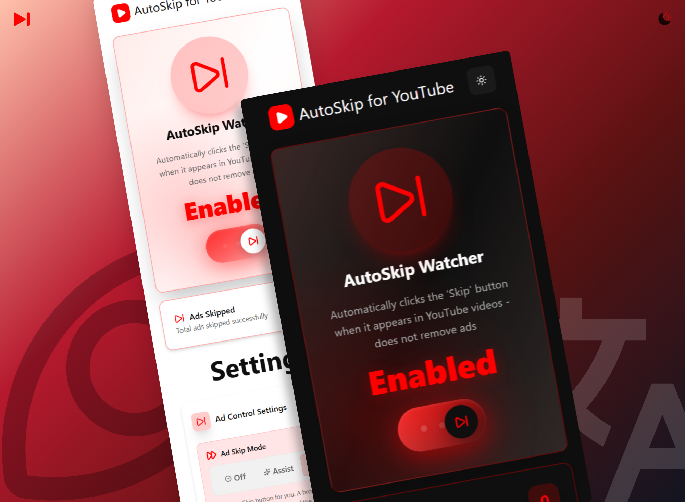

<h1 align="center">
  
  AutoSkip for YouTube
</h1>
<p align="center">
  <em>
    A smart and lightweight Chrome extension that helps you skip YouTube ads using multiple skip modes,
    from highlighting the Skip Ad button to clicking it automatically when it appears.
    It never deletes or blocks ads and only interacts with YouTube's official "Skip Ad" button.
  </em>
</p>

<p align="center">
  
  
  
  
</p>

---

## ✨ Overview

**AutoSkip for YouTube** is a modern **Chrome Extension** built with **React** and **TypeScript**
that gives you flexible control over YouTube's **Skip Ad** button without removing or blocking ads.

### ⏭️ Skip Modes

AutoSkip provides multiple ways to handle skippable ads:

* 👆 **Auto Mode** — Automatically clicks the **Skip Ad** button as soon as it appears.
* ⚡ **Assist Mode** — Highlights the **Skip Ad** button when it appears, so you can click it yourself.
* ⏹️ **Off Mode** — Leaves the **Skip Ad** button completely untouched.

The extension only interacts with YouTube's official **"Skip Ad"** button.
It **does not remove, block, or hide ads**.

---

## 📸 Preview



---

## 🎯 Core Features

| Feature | Description |
|------|------------|
| ⏭ **Three-Mode Ad Skipping** | Choose how ads are skipped: **Off** (extension never touches the button), **Assist** (highlights the Skip button so you click it yourself — no extra permission needed), or **Auto** (clicks it for you automatically) |
| 🛡 **Transparent Permission Prompt** | Before enabling Auto mode, a clear in-app dialog explains exactly what will happen — before Chrome's own technical permission prompt ever appears |
| 🔇 **Mute Ads** | Automatically mutes ad audio |
| 🌫 **Blur Ads** | Blurs ad videos instead of removing them, reducing distraction while preserving content |
| 🧮 **Ads Skipped Counter** | Keeps track of the total number of ads successfully skipped |
| ⚠️ **Selector Health Warning** | Detects when YouTube changes its layout and a Skip button can no longer be found, and surfaces a warning in the popup |
| 🎛 **Master Enable / Disable Toggle** | One switch to turn the whole extension on or off |
| 🌍 **Multi-language Support** | Built-in internationalization using **i18next** (English & Arabic, with full RTL support) |
| 🎨 **Modern UI** | Clean UI built with Tailwind CSS and Radix UI, with Dark/Light theme support |
| ⚡ **High Performance** | Mutation-observer driven detection with a safety-net interval only as a fallback — minimal impact on browser performance |

---

## 🛠️ Tech Stack

| Category | Tools & Libraries |
|-------|------------------|
| **Core** | React 19.2.0, TypeScript 5.9.3, Vite 7.2.2 |
| **Extension APIs** | Chrome Extensions API (`storage`, `debugger`) |
| **UI** | Tailwind CSS, Shadcn / UI, Lucide Icons |
| **State & Logic** | Custom logic + Chrome storage (`sync` for settings, `local` for the counter) |
| **Animations** | Motion |
| **Internationalization** | i18next, react-i18next |
| **Testing** | Playwright (selector health checks against the live YouTube DOM) |

---

## 📁 Folder Structure

```md

AutoSkip-for-YouTube/
├── src/
│   ├── components/          # Reusable UI components
│   │   ├── shared/          # Shared / common components
│   │   └── ui/              # Design system & primitive UI components
│   ├── constants/           # App-wide constants & enums
│   ├── contexts/            # React contexts (theme)
│   ├── extension/           # Chrome extension logic
│   │   ├── background.ts    # Background service worker
│   │   ├── content.ts       # Content script (YouTube DOM interaction)
│   │   └── shared/           # Selectors, storage helpers, logger
│   ├── hooks/                # Custom React hooks (watcher state, skip mode, theme)
│   ├── i18n/                 # i18next configuration & initialization
│   ├── lib/                  # Shared libraries & helpers
│   ├── types/                 # Global TypeScript types
│   ├── utils/                 # Utility functions
│   ├── App.tsx                # Popup root component
│   └── main.tsx                # React entry point
│
├── public/
│   ├── _locales/              # Chrome extension metadata translations
│   ├── assets/
│   │   ├── icons/              # Extension icons
│   │   └── screenshots/        # README screenshots
│   ├── locales/                # UI translations (design text & labels)
│   └── manifest.json           # Chrome extension manifest
│
├── tests/                      # Playwright selector health tests
├── vite.config.ts              # Vite base config (popup UI)
├── vite.content.config.ts      # Vite config for content script
├── vite.background.config.ts   # Vite config for background worker
└── package.json

```

---

## 🎨 UI & UX

| Feature                      | Description                          |
| ---------------------------- | ------------------------------------ |
| 🌗 **Dark / Light Mode**     | Theme-friendly UI                    |
| 🧩 **Accessible Components** | Powered by Radix UI                  |
| 📱 **Responsive Popup**      | Works perfectly in Chrome popup size |
| ✨ **Smooth Animations**     | Motion-based interactions            |
| 🔁 **RTL-aware**             | Mirrors layout, switches, and the Skip-mode highlight correctly in Arabic |

---

## 🔒 Permissions & Security

| Permission | Why it's needed |
| ---------- | ---------------- |
| `storage`  | Saves your settings (skip mode, mute, blur, language, theme) and the ads-skipped counter locally |
| `host_permissions` (`*.youtube.com`, `*.youtube-nocookie.com`) | Lets the content script detect and interact with the Skip button on YouTube pages only |
| `debugger` | Used **only** in Auto mode, and only for the instant it dispatches a real click on the Skip button. You are shown an in-app explanation before this is ever used, and you can switch back to Assist or Off at any time |

| Item                     | Details                               |
| ------------------------ | -------------------------------------- |
| 🛡 **Safe DOM Handling**  | No invasive page modifications — mute, blur and highlight are applied via separate overlays, never by editing YouTube's own elements |
| 🔒 **No Data Tracking**  | No user data collection, no external network requests |
| 📝 **Validation**        | Safe logic and controlled execution, with graceful fallbacks if YouTube changes its layout |

---

## 📥 Quick Install (No Building Required)

> 💡 **Recommended for most users** — download the pre-built extension and load it directly. No Node.js, no terminal, no build step.

| Step | What to do |
|:---:|---|
| 1️⃣ | Download the latest `.zip` from the [**Releases page**](https://github.com/Maher-Elmair/AutoSkip-for-YouTube/releases/latest) |
| 2️⃣ | Extract the zip file to a folder on your computer |
| 3️⃣ | Open Chrome and go to `chrome://extensions` |
| 4️⃣ | Enable **Developer mode** (top-right toggle) |
| 5️⃣ | Click **Load unpacked** and select the extracted folder |
| 6️⃣ | ✅ Done! The AutoSkip icon now appears in your toolbar |

---

## 🚀 Quick Start (Development)

```bash

git clone https://github.com/your-username/AutoSkip-for-YouTube.git
cd AutoSkip-for-YouTube
npm install
npm run dev

```

### Build Extension

```bash

npm run build

```

After build:

1. Open **Chrome**
2. Go to `chrome://extensions`
3. Enable **Developer mode**
4. Click **Load unpacked**
5. Select the `dist` folder

### Run Selector Health Tests

```bash

npx playwright install --with-deps chromium
npx playwright test

```

---

## 🛣 Roadmap

| Feature                                 | Status      |
| --------------------------------------- | ----------- |
| Better mute logic for non-skippable ads | Planned     |
| Custom delay before skipping            | Planned     |
| Expanded language support beyond English/Arabic | Planned |
| Firefox support                         | In progress |

---

## 🚧 Future Enhancements

The following features are planned for future releases to improve flexibility, accessibility, and user control:

### 🌍 Expanded Language Support
- Add more UI languages beyond Arabic and English
- Improve language detection and fallback handling
- Community-driven translations

### 🔊 Ad Volume Control
- Add a volume slider to control **ad sound level**
- Allow partial muting instead of full mute
- Save preferred ad volume per user

### 🌫 Ad Transparency Control
- Add a transparency (opacity) slider for ad videos
- Allow users to visually reduce ad visibility instead of hiding them
- Smooth transitions when adjusting transparency

### ⚙️ General Improvements
- Continue hardening skip detection against future YouTube layout changes
- Better handling of YouTube DOM updates
- Improved performance and lower CPU usage

### ⏱ Custom Delay Before Skipping
- Let users set a personalized delay before the skip action triggers

---

## 👨‍💻 Author

**Maher Elmair**

* 📫 [maher.elmair.dev@gmail.com](mailto:maher.elmair.dev@gmail.com)
* 🔗 [LinkedIn](https://www.linkedin.com/in/maher-elmair)
* ✖️ [X (Twitter)](https://x.com/Maher_Elmair)
* ❤️ Made with passion by [Maher Elmair](https://maher-elmair.github.io/My_Website)

---

## 🌐 Live Demo

🚀 **Try the AutoSkip UI live (Popup Preview):**
👉 [AutoSkip.vercel.app](https://autoskip-for-youtube.vercel.app/)

> This live demo showcases the **popup UI design**, including:
> - Dark / Light themes
> - Arabic & English language support
> - Settings layout and interactions, including the Skip Mode switch

---

🙌 **Thank you for visiting!**
If you liked the project, please ⭐ the repository!

Contributions, feedback, and PRs are always welcome 🙏<br>
If you have any solutions for the current issues or ideas to help implement the future enhancements listed above,<br>
don't hesitate to submit them — I will gladly review and accept them!

---

<h6 align="center"><i>AutoSkip for YouTube — Skip ads the moment the Skip button appears</i></h6>